# Linear Attention Vision Transformers for CMS End-to-End Jet Classification

> Domain MAE pretraining on unlabelled CMS jet images combined with linear cross-covariance attention achieves **AUC 0.9237** and **2.4× physics significance improvement** — outperforming both ImageNet pretraining and softmax attention baselines on 8-channel E2E detector images.

[](https://python.org)
[](https://pytorch.org)
[](https://github.com/huggingface/pytorch-image-models)
[](LICENSE)
[](https://ml4sci.org)
[](notebooks/01_model_training.ipynb)
[](notebooks/02_analysis_and_results.ipynb)

---

## Table of Contents

1. [Overview](#1-overview)
2. [Key Results at a Glance](#2-key-results-at-a-glance)
3. [Model Architectures](#3-model-architectures)
4. [MAE Pretraining](#4-mae-pretraining)
5. [Finetuning Protocol](#5-finetuning-protocol)
6. [Training Results](#6-training-results)
7. [Analysis Results](#7-analysis-results)
8. [Installation](#8-installation)
9. [Data and Weights](#9-data-and-weights)
10. [Quick Start](#10-quick-start)
11. [Repository Structure](#11-repository-structure)
12. [Module Documentation](#12-module-documentation)
13. [Limitations and Open Questions](#13-limitations-and-open-questions)
14. [GSoC ML4Sci Context](#14-gsoc-ml4sci-context)
15. [Citations](#15-citations)
16. [License](#16-license)

---

## 1. Overview

This repository contains the full research pipeline for **GSoC 2026 ML4Sci Task 2h** — evaluating linear attention vision transformers for CMS end-to-end (E2E) jet classification. Five ViT architectures are trained under identical conditions to isolate the effects of attention mechanism and pretraining strategy on 8-channel CMS detector images.

**The three questions this work answers:**
- Does linear cross-covariance attention outperform softmax window attention on sparse, multi-channel physics detector data?
- How much does domain-specific MAE pretraining on unlabelled CMS jets help compared to ImageNet pretraining or random initialisation?
- What does the AUC improvement translate to in real CMS physics terms — specifically S/√B significance improvement?

**The physics problem:** The CMS detector records particle collisions as 8-channel 125×125 images per jet event, where each channel corresponds to a different detector subsystem. The task is binary classification — signal (potential BSM new physics) vs background (known QCD processes). These images are extremely sparse (99.1% zero pixels) and have no resemblance to the natural RGB images that standard computer vision architectures are designed for. This makes the choice of attention mechanism and pretraining strategy non-trivial.

---

## 2. Key Results at a Glance

| Model | AUC ± CI | Acc | Rej@90 | Rej@95 | Max SIC | ECE | Params | img/s |
|---|---|---|---|---|---|---|---|---|
| **XCiT + CMS MAE** | **0.9236 ± 0.0063** | **0.855** | **0.830** | **0.778** | 2.40× | 0.059 | 26.07M | 10,170 |
| XCiT + ImageNet | 0.9064 ± 0.0070 | 0.839 | 0.780 | 0.637 | **2.42×** | 0.047 | 26.07M | 10,128 |
| L2ViT + CMS MAE | 0.9138 ± 0.0067 | 0.856 | 0.811 | 0.727 | 2.40× | **0.037** | 29.28M | 8,723 |
| XCiT scratch | 0.7983 ± 0.0097 | 0.725 | 0.449 | 0.307 | 1.70× | 0.125 | 26.07M | 10,161 |
| Swin-T scratch | 0.7357 ± 0.0111 | 0.546 | 0.380 | 0.250 | 1.14× | 0.027* | 27.92M | 9,997 |

> AUC CI = 1000-iteration bootstrap on the held-out test set. Rej@X = background rejection at X% signal efficiency. Max SIC = peak S/√B improvement. *Swin-T ECE is trivially low — all scores near 0.5, not a meaningful result.

**Four headline findings:**
- **Domain pretraining wins:** XCiT + CMS MAE outperforms XCiT scratch by **+0.125 AUC** and delivers **3× better background rejection at 95% signal efficiency** (Rej@95: 0.778 vs 0.307)
- **Linear attention wins on sparse data:** XCiT scratch vs Swin-T scratch under identical conditions — +0.063 AUC gap attributable purely to the attention mechanism
- **Pretraining worth 5× labels:** At 76 labelled samples, the pretrained model (AUC 0.875) beats scratch with 5× more data (380 samples, AUC 0.717)
- **CKA proves different solutions:** Finetuned vs scratch CKA is **0.008–0.015 at every layer** — pretraining leads to an entirely different solution in representation space, not just a better starting point

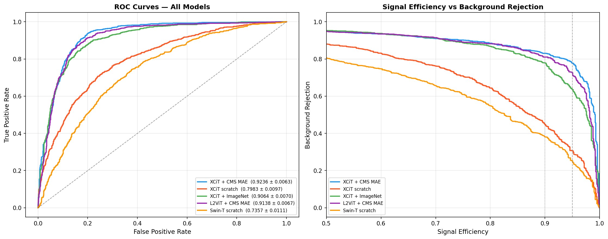
*Left: ROC curves for all 5 models. Right: Signal efficiency vs background rejection — the pretrained models maintain >80% background rejection across the full operating range.*

---

## 3. Model Architectures

Five models trained under identical conditions to isolate the effect of attention mechanism and pretraining strategy. All share an identical dual head — one sigmoid output for binary classification and one scalar for proxy mass regression (λ=0.1).

| Model | Attention | Init | Params | Key Property |
|---|---|---|---|---|
| XCiT + CMS MAE | Linear cross-covariance (XCA) | Domain MAE pretrained | 26.07M | Best AUC, flattest SIC curve |
| XCiT + ImageNet | Linear cross-covariance (XCA) | ImageNet supervised | 26.07M | Highest peak SIC (2.42×) |
| XCiT scratch | Linear cross-covariance (XCA) | Random | 26.07M | Linear attention baseline |
| L2ViT + CMS MAE | Linear global + local window | Domain MAE pretrained | 29.28M | Most robust, best calibrated |
| Swin-T scratch | Softmax shifted-window | Random | 27.92M | Softmax attention baseline |

### 3.1 XCiT — Cross-Covariance Attention

XCiT replaces standard token-token attention with cross-covariance attention (XCA) operating in the channel dimension rather than the spatial dimension. Standard attention complexity is O(N²d) where N is sequence length — XCA is O(C²N) where C is channel dimension. For our 8×8 token grid (64 tokens at 16×16 patch size), XCA provides a natural fit: the model attends across all 64 spatial tokens simultaneously rather than within local windows, making it better suited to globally sparse jet images.

### 3.2 L2ViT — Hierarchical Linear + Local Attention

L2ViT is a custom 4-stage hierarchical architecture built specifically for this study. Each stage combines Local Window Attention (LWA, 7×7 windows) for fine-grained local structure with Linear Global Attention (LGA) using a ReLU kernel and a Local Concentration Module (LCM) that corrects the spatial diffuseness inherent in linear attention. Channel dimensions double across stages: 96 → 192 → 384 → 768.

```
Input (8, 128, 128)
  └── Conv stem (4× downsampling)
       └── Stage 1: CPE → LWA → FFN → CPE → LGA+LCM → FFN   [d=96]
            └── Merge (stride-2 conv)
                 └── Stage 2: ...                              [d=192]
                      └── Merge
                           └── Stage 3 (3 blocks): ...        [d=384]
                                └── Merge
                                     └── Stage 4: ...         [d=768]
                                          └── GAP → DualHead
```

### 3.3 Swin-T — Softmax Baseline

Swin-T with shifted-window softmax attention serves as the softmax baseline. Compared under identical conditions to XCiT scratch, the attention mechanism is the only meaningful variable — isolating its effect on sparse jet image classification.

### 3.4 Dual Head

Both outputs share the backbone features with separate head branches:

```python
DualHead(feat_dim):
    cls: LayerNorm → Linear(256) → GELU → Dropout(0.2) → Linear(1)  # BCE
    reg: LayerNorm → Linear(256) → GELU → Dropout(0.2) → Linear(1)  # proxy mass MSE
```

Joint training with λ=0.1 consistently improves classification AUC slightly over classification alone — the regression term acts as a soft regulariser encouraging spatially aware representations.

---

## 4. MAE Pretraining

60,000 unlabelled CMS jet images are used for self-supervised pretraining before any labelled data is introduced. The backbone learns to reconstruct 75% randomly masked patches from the visible 25% — forcing it to model jet structure rather than memorise pixel statistics.

```
Unlabelled CMS jets (60k)
  └── Random patch masking (75%)
       └── XCiT/L2ViT encoder
            └── Lightweight decoder
                 └── MSE reconstruction loss (masked patches only)
                      └── Save backbone — discard decoder
```

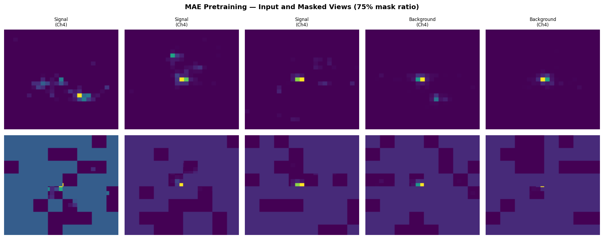
*Top row: original jet images (Channel 4). Bottom row: same images with 75% of 16×16 patches masked. The backbone learns to infer jet structure from the remaining 25%.*

| Model | Masking Space | Best Loss | Best Epoch | Loss Reduction |
|---|---|---|---|---|
| XCiT MAE | Token space | 0.04188 | 46/50 | 89% in epoch 1 |
| L2ViT MAE | Pixel space | 0.20342 | 40/50 | Gradual convergence |

L2ViT uses pixel-space masking rather than token-space masking because the hierarchical convolutional stem makes token-level masking architecturally awkward. The higher absolute loss for L2ViT is expected — pixel-space reconstruction is a harder task than token-space reconstruction.

---

## 5. Finetuning Protocol

All five models use the same two-stage finetuning protocol. The test set of 2,000 samples is held out before any training begins and never used for any decision during development.

**Stage 1 — Frozen backbone, heads only**

The backbone is frozen and only the dual head is trained. This gets the classification and regression heads to a reasonable starting point before any gradients flow through the pretrained representations.

**Stage 2 — Full model**

The backbone unfreezes at a very low learning rate. For pretrained models (5e-6) this preserves the MAE representations while allowing domain adaptation. For scratch models (1e-5) there are no representations to preserve so a slightly higher rate is used.

| Hyperparameter | Value |
|---|---|
| Optimizer | AdamW |
| Weight decay | 0.05 |
| Stage 1 LR | 1e-3 |
| Stage 2 LR (pretrained) | 5e-6 |
| Stage 2 LR (scratch) | 1e-5 |
| Batch size | 128 |
| Label smoothing | 0.1 |
| Regression weight λ | 0.1 |
| Gradient clip | 1.0 |
| AMP | Enabled |
| Early stopping (S1) | patience=8 |
| Early stopping (S2) | patience=10 |
| Hardware | Google Colab T4 GPU |

**Dataset split:**

| Split | Samples | Purpose |
|---|---|---|
| Train | 6,400 | Model training (80% of labelled) |
| Val | 1,600 | Early stopping and checkpoint selection |
| Test | 2,000 | Final evaluation only — never touched during training |
| Unlabelled | 60,000 | MAE pretraining only |

---

## 6. Training Results


*Validation AUC across all training epochs for all 5 models. Stage 2 starts at the dashed vertical line. The brief AUC dip at stage 2 start is expected — unfreezing the backbone temporarily disrupts the head's calibration before the full model converges.*

**Per-model highlights:**

**XCiT + CMS MAE** — Val AUC jumps from 0.84 (stage 1) to 0.95 within 5 epochs of stage 2. Pretrained features adapt rapidly — the backbone needed minimal reorganisation.

**XCiT scratch** — Classic overfitting in stage 2. Train loss drops to 0.24 while val loss rises and becomes noisy. The model never learned a stable discriminating representation.

**XCiT + ImageNet** — Strong stage 1 start (AUC 0.883 at epoch 2 — ImageNet features transfer well initially) but overfits in stage 2. Cross-domain pretraining provides early advantage but no long-term stability.

**L2ViT + CMS MAE** — Slow stage 1 (all 30 epochs, best AUC 0.799). Noisy stage 2 (val loss spikes to 1.3) because 4 hierarchical stages unfreeze simultaneously — competing gradient flows. Best checkpoint mechanism handles this correctly.

**Swin-T scratch** — Val accuracy stuck at 59.25% throughout stage 1. This is exactly the background class proportion — the model predicts background for everything. Signal recall at final evaluation: 11.7%.

---

## 7. Analysis Results

Full analysis notebook: `02_analysis_and_results.ipynb`. All 11 studies run on the same 2,000-sample held-out test set.

| Study | Key Finding | Key Number |
|---|---|---|
| Channel Importance | Ch0+Ch3 critical, Ch2 redundant | AUC drop: 0.456 / 0.060 |
| Channel Pairs | No synergistic pairs, Ch0+Ch3 worst combo | Combined drop: 0.616 |
| Grad-CAM | Patch-level saliency, signal more distributed | 16×16 grid (XCA architectural) |
| t-SNE (5 models) | Separation scores track AUC exactly | 2.34 → 0.63 |
| Layer t-SNE | Block 1 alone beats fully trained scratch | sep 1.53 vs 0.63 |
| CKA | Finetuned vs scratch near zero everywhere | 0.008–0.015 all 12 layers |
| Data Efficiency | 5× labelled data efficiency at low-label end | gap +0.192 at n=76 |
| Jet Multiplicity | Signal 34% denser, confidence correlated | correlation 0.55 |
| Energy Threshold | AUC stable until t=20, degrades to 0.624 | drop 0.058 at t=50 |
| S/√B Significance | All pretrained ~2.4×, scratch 1.70×, Swin 1.14× | max 2.42× |
| Robustness | L2ViT most robust, L2ViT 90° rotation sensitive | noise drop 0.008 / rot −0.310 |
| Calibration | L2ViT best, XCiT scratch overconfident | ECE 0.037 / 0.125 |
| Efficiency | XCiT MAE best AUC/compute, Swin dominated | 10,170 img/s at 1.58 GFLOPs |

### 7.1 Channel Importance

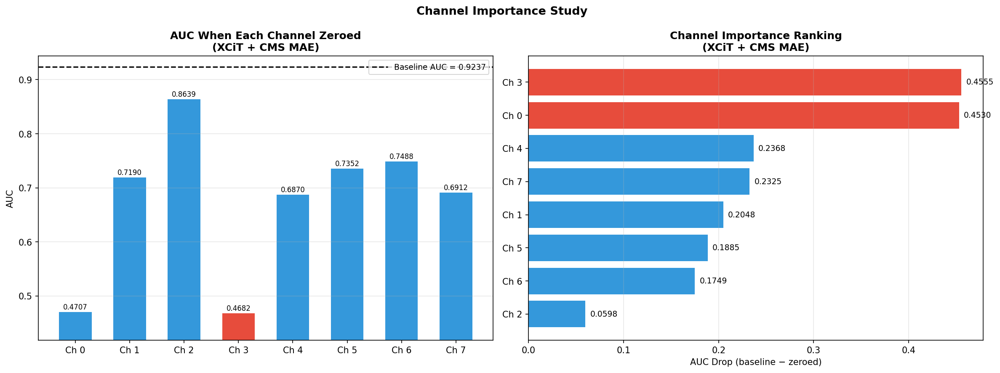
*Left: AUC when each channel is zeroed. Ch0 and Ch3 collapse performance to near-random. Right: importance ranking — Ch3 and Ch0 are 7× more important than Ch2.*

Zeroing Ch0 or Ch3 individually collapses AUC from 0.9237 to ~0.47 — essentially random. Ch2 is nearly redundant (drop 0.060). The pretrained model learned selective channel dependence; XCiT scratch distributes importance more evenly. XCiT + ImageNet shows drops < 0.10 across all channels — ImageNet features have no CMS channel specialisation. Physical identity of channels is unconfirmed and requires dataset documentation.

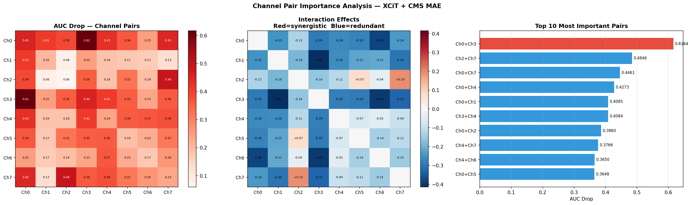
*Left: AUC drop heatmap for all 28 channel pairs. Center: interaction effects — all blue (redundant), no red (synergistic). Right: top 10 most important pairs.*

No synergistic channel pairs exist — every pair shows negative interaction. Ch0+Ch3 together drop AUC to 0.307 (combined drop 0.616). Strongest redundancy: Ch1+Ch3 (−0.415). The only near-positive interactions involve Ch2 — it carries complementary information only useful in combination, not independently.

### 7.2 Grad-CAM Saliency

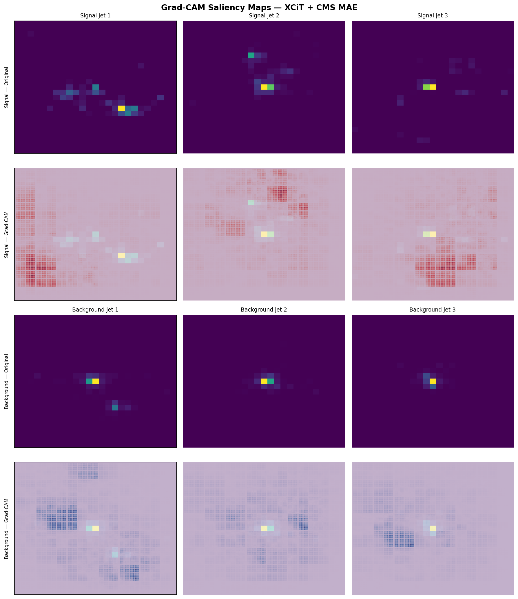
*Rows 1-2: signal jets (original + saliency overlay). Rows 3-4: background jets. The 16×16 grid pattern reflects XCiT's patch tokenisation — saliency is patch-level, not pixel-level.*

XCiT uses channel-space attention — Grad-CAM produces patch-level (16×16) saliency maps rather than pixel-level activations. Signal jets show saliency distributed across multiple patches, consistent with extended jet substructure from heavy particle decays. Background jets show concentrated saliency near a single energy cluster. The AUC of 0.9237 confirms the model learns genuine discriminating features despite non-spatial attention.

### 7.3 Feature Representations

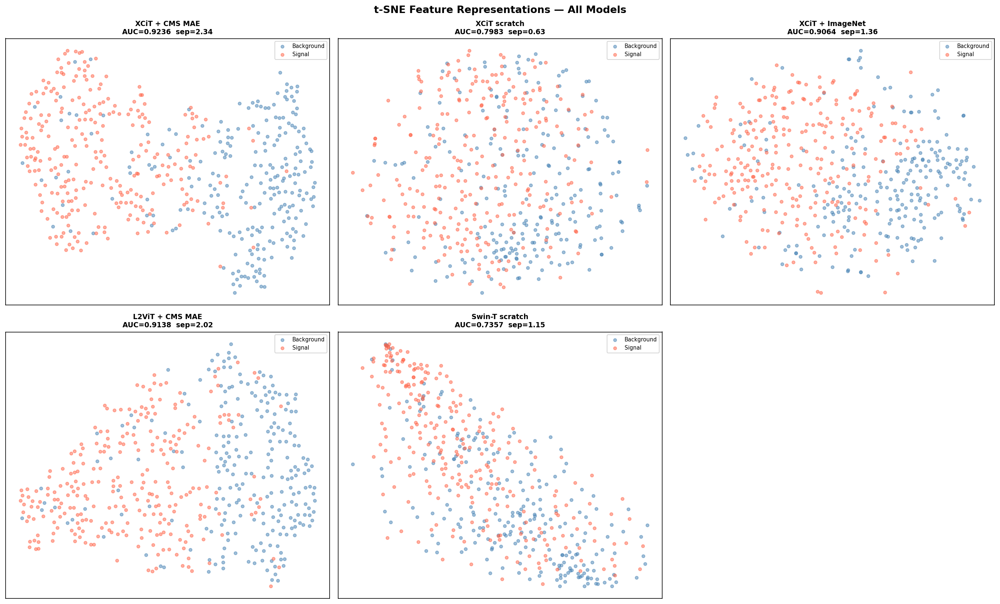
*2D t-SNE projections of backbone features (500 test samples). Separation score annotated per model. XCiT MAE (2.34) and L2ViT MAE (2.05) form clearly distinct signal/background regions; XCiT scratch (0.63) is almost completely mixed.*

Separation scores track AUC almost perfectly: XCiT MAE (2.34) → L2ViT MAE (2.02) → ImageNet (1.36) → Swin (1.15) → scratch (0.63). XCiT scratch features are nearly mixed in 2D despite AUC 0.799 — the scratch model learned a weak high-dimensional separator, not visible in t-SNE projection.

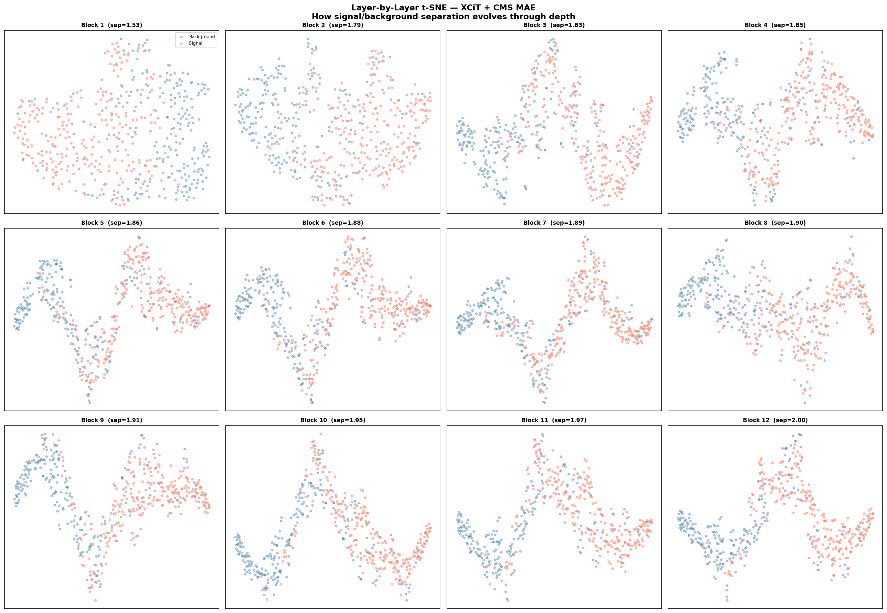
*t-SNE at each of the 12 XCiT attention blocks. Separation increases monotonically — no single block does all the work. By block 12 signal and background form clearly distinct regions.*

Separation increases monotonically from block 1 (1.53) to block 12 (2.00). **Block 1 of the pretrained model alone (sep=1.53) beats fully trained XCiT scratch (sep=0.63)** — direct evidence that MAE pretraining on unlabelled jets encodes genuine jet structure before any classification signal is introduced.

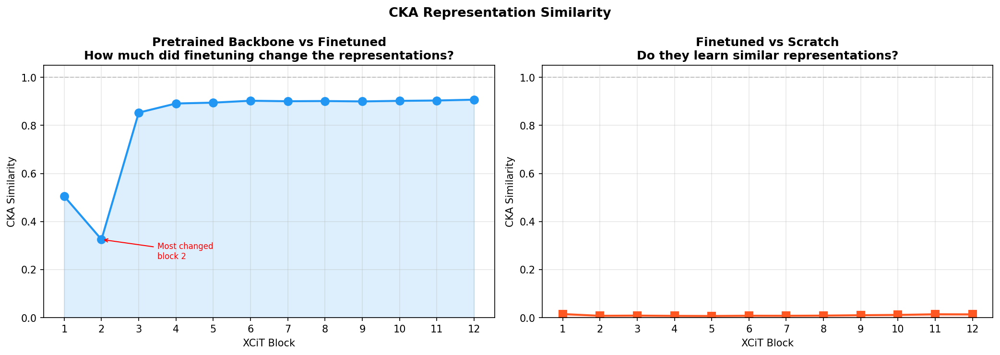
*Left: pretrained vs finetuned CKA per layer — block 2 most changed (0.325), late layers preserved (~0.900). Right: finetuned vs scratch — effectively zero at every layer.*

Finetuned vs scratch CKA is **0.008–0.015 at every layer**. Same architecture, same data, completely different internal representations. This rules out the hypothesis that scratch is learning the same features more slowly — if so, CKA would be moderate and depth-increasing. Near-zero CKA everywhere means pretraining leads to an entirely different solution in representation space.

### 7.4 Data Efficiency

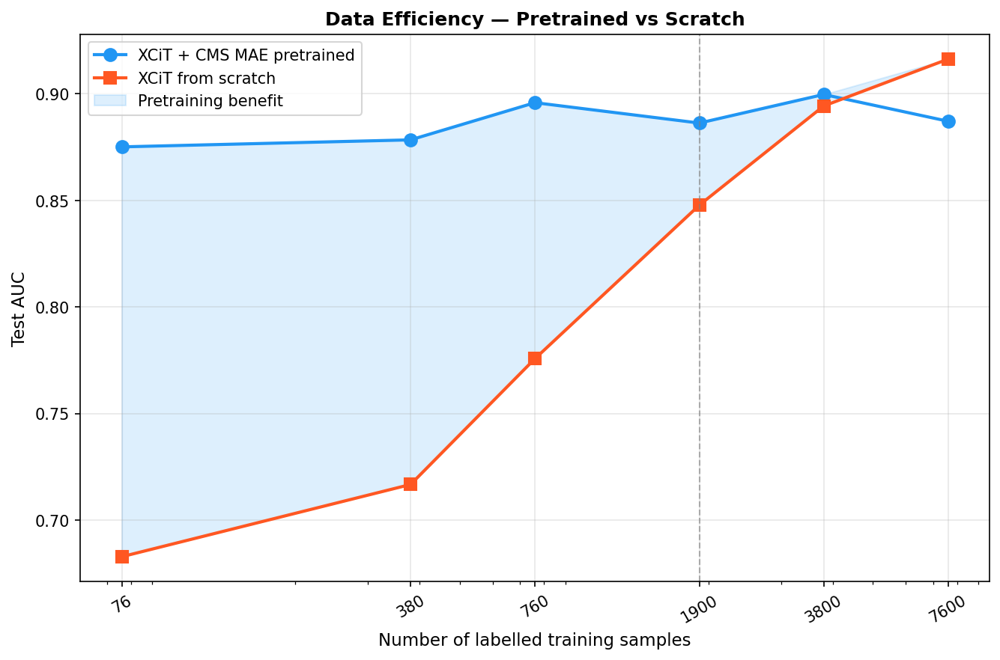
*AUC vs number of labelled training samples (log scale). Shaded region: pretraining benefit. The pretrained model with 76 samples beats scratch with 380 samples.*

At **76 labelled samples**: pretrained AUC 0.875 vs scratch 0.683 (+0.192). The pretrained model with 76 samples outperforms scratch with 5× more data. The gap closes at ~3,800 samples; scratch edges ahead at 7,600 (−0.029). Note: numbers are an upper bound — the pretrained model was initialised from finetuned weights rather than MAE-only backbone.

### 7.5 Physics Studies

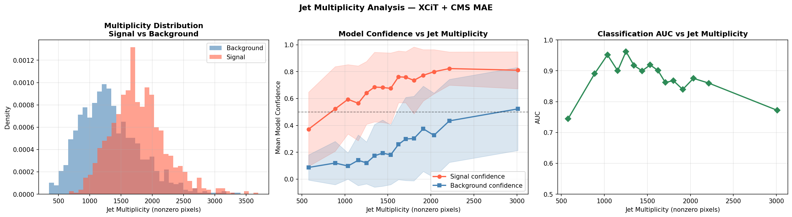
*Left: multiplicity distributions — signal jets are 34% denser. Center: model confidence vs multiplicity. Right: AUC vs multiplicity — peaks at intermediate multiplicities where signal/background differ most.*

Signal jets average **1,774.7 nonzero pixels** vs background **1,326.8** (34% difference). Confidence-multiplicity correlation is 0.55 — the model partially uses hit count as a classification cue alongside jet substructure. AUC peaks at 1,000–1,300 pixels and declines at high multiplicity where signal and background distributions overlap.

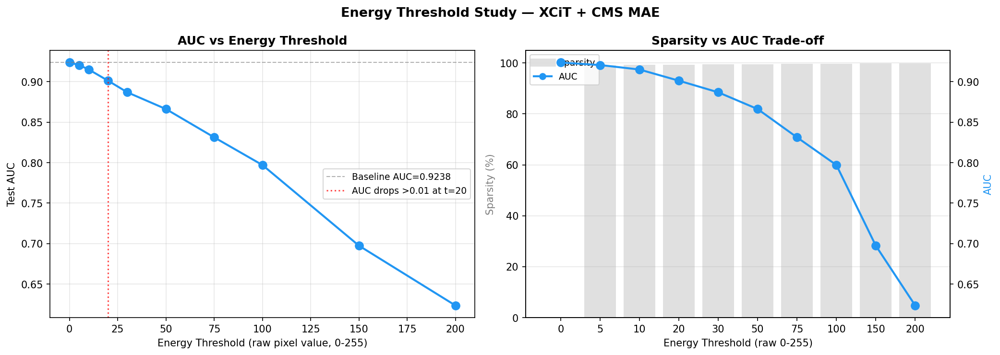
*Left: AUC vs energy threshold — drops meaningfully from t=20. Right: sparsity vs AUC trade-off — the baseline is already 99.1% sparse at t=5, yet AUC holds until t=20.*

The baseline image is already **99.1% sparse** at threshold=5 — yet AUC only drops 0.003. Meaningful degradation starts at **threshold=20** (drop 0.023). At threshold=50, drop is **0.058**. The model relies on low-energy deposits (5–50 raw pixel units) that carry jet substructure information. Aggressive detector zero-suppression destroys this information in a way no better model can recover.

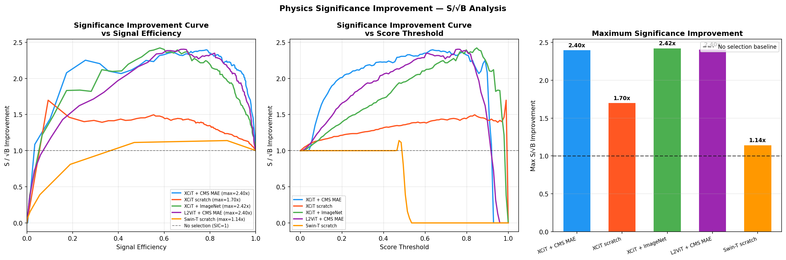
*Left: SIC vs signal efficiency. Center: SIC vs score threshold. Right: maximum SIC per model — pretrained models deliver ~2.4×, scratch 1.70×, Swin barely 1.14×.*

All three pretrained models deliver **~2.40–2.42× significance improvement** — statistically indistinguishable. Scratch: 1.70×. Swin: 1.14×. Optimal thresholds differ between models (0.636–0.848) — a threshold tuned on one model is not transferable. XCiT + CMS MAE has the flattest SIC curve, making working point selection most robust to calibration uncertainty.

### 7.6 Robustness Studies

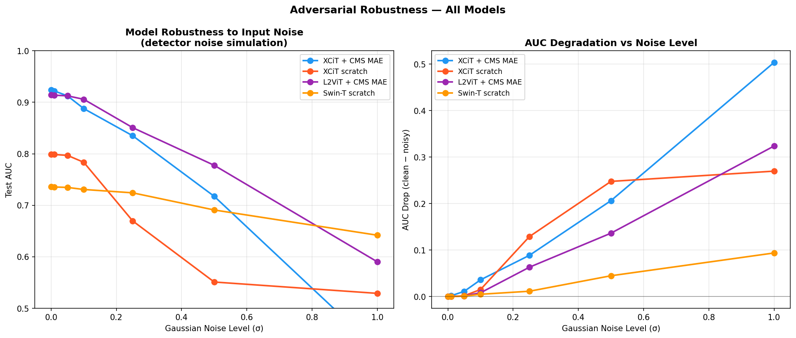
*Left: AUC vs Gaussian noise level. Right: AUC degradation — L2ViT degrades slowest, XCiT MAE fastest at high noise despite higher clean AUC.*

**L2ViT is the most robust model** — AUC drop 0.008 at sigma=0.1 vs 0.036 for XCiT MAE. L2ViT's local window attention provides implicit spatial smoothing. Swin-T shows small absolute drop (0.005) but this is a ceiling effect from its already-low baseline.

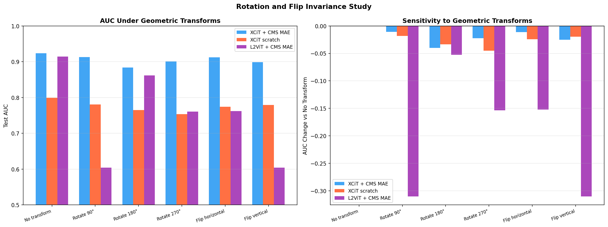
*Left: AUC per geometric transform. Right: AUC change vs no transform — L2ViT shows extreme sensitivity to 90°/270° rotation.*

XCiT MAE is most rotation-stable (max drop −0.040 at 180°). L2ViT drops **−0.310 at 90° rotation** — direct consequence of 7×7 window partitioning: 90° rotation destroys local neighbourhoods while 180° rotation preserves them (drop only −0.053). Rotation augmentation during training would fix this.

OOD inputs are correctly handled: **0% of Gaussian noise samples** exceed 0.9 confidence vs 41.5% of real jets. OOD noise clusters at P(signal)≈0.33 — the model confidently predicts background rather than outputting uncertain near-0.5 scores.

### 7.7 Calibration

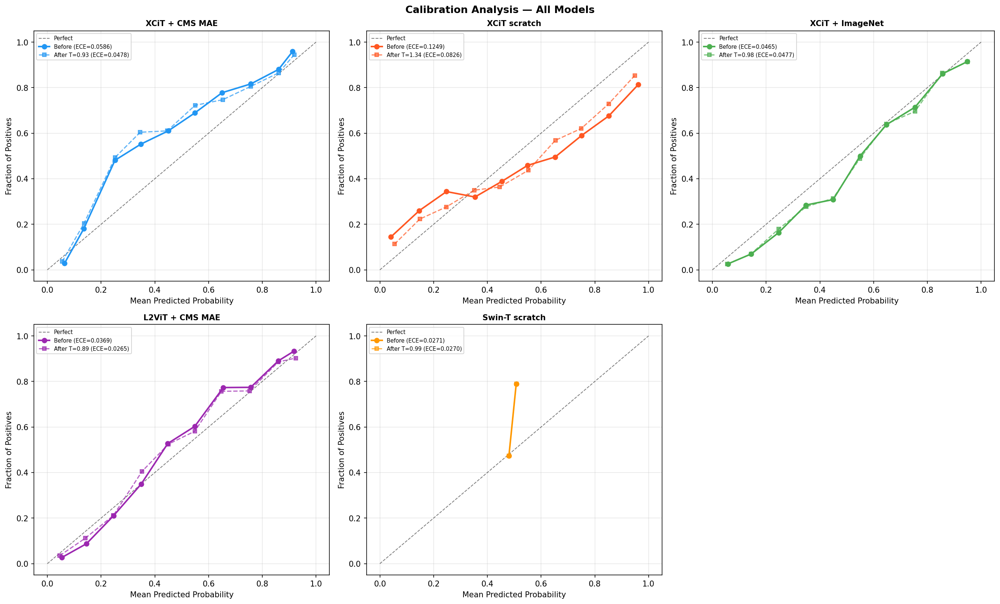
*Calibration curves for all 5 models before (solid) and after (dashed) temperature scaling. L2ViT closest to the diagonal. Swin-T curve has only two points — scores never leave the 0.47-0.53 range.*

**L2ViT is the best calibrated model** — ECE 0.0369 before, 0.0265 after temperature scaling (T=0.887, slightly underconfident). XCiT scratch worst at ECE 0.1249 (T=1.337, overconfident) — consistent with stage 2 overfitting. Swin-T ECE 0.0271 is trivially achieved by predicting ~0.5 for everything. **L2ViT is both the most noise-robust and the best-calibrated model** — the better choice for analyses requiring reliable probability scores.

### 7.8 Efficiency Benchmarks

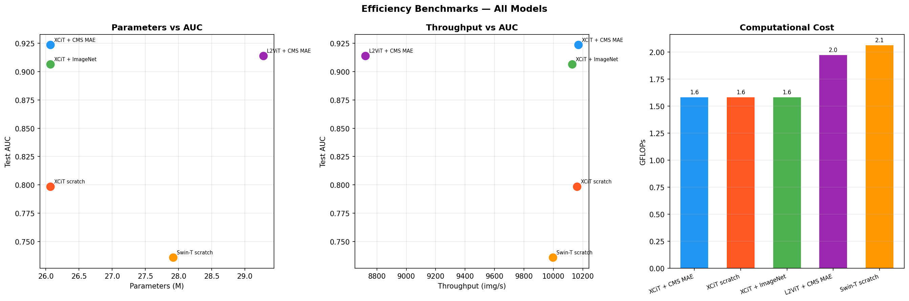
*Left: parameters vs AUC. Center: throughput vs AUC — XCiT MAE is top-right (best AUC, high throughput). Right: GFLOPs — Swin-T most expensive with worst AUC.*

All XCiT variants: identical **1.58 GFLOPs, ~10,150 img/s** — pretraining adds zero inference cost. L2ViT: 1.97 GFLOPs, 8,723 img/s (14% slower). Swin-T: most compute (2.06 GFLOPs) and worst AUC — strictly dominated by every other model. **XCiT + CMS MAE is the practical recommendation** — highest AUC, lowest compute among competitive models. Benchmarks on Colab A100, batch=64, AMP enabled.

---

## 8. Installation

**Requirements**

- Python >= 3.10
- PyTorch >= 2.0 with CUDA
- GPU recommended (all experiments on Colab T4/A100)

```bash
git clone https://github.com/nareshmeena12/linear-attention-jet-classification
cd linear-attention-jet-classification
pip install -e .
```

Or install dependencies directly:

```bash
pip install torch torchvision timm h5py scikit-learn fvcore
```

Full reproducibility:

```bash
pip install -r requirements.txt
```

---

## 9. Data and Weights

### Dataset

| File | Samples | Download |
|---|---|---|
| `cms_jet_train.h5` | 8,000 | `kaggle kernels output nareshmeena12/dataset-preparation-ipynb -p ./data` |
| `cms_jet_test.h5` | 2,000 | Same kernel |
| `Dataset_Specific_Unlabelled.h5` | 60,000 | `kaggle datasets download nareshmeena01/gsoc-task-2h-pretraining-data -p ./data --unzip` |

**Format:** HDF5 with key `'jet'` (shape: N × 125 × 125 × 8) and key `'Y'` (labels: 0=background, 1=signal).
**Normalisation:** per-channel mean/std computed from nonzero pixels only — stored in `results/channel_stats.npy`.

### Pretrained Weights

All model weights are stored on Google Drive. Weights are excluded from the GitHub repo due to size.

| File | Model | AUC |
|---|---|---|
| `xcit_mae_finetuned_best.pth` | XCiT + CMS MAE | 0.9237 |
| `xcit_imagenet_best.pth` | XCiT + ImageNet | 0.9068 |
| `l2vit_mae_finetuned_best.pth` | L2ViT + CMS MAE | 0.9140 |
| `xcit_scratch_best.pth` | XCiT scratch | 0.7987 |
| `swin_scratch_best.pth` | Swin-T scratch | 0.7357 |
| `xcit_pretrained_backbone.pth` | XCiT MAE backbone only | — |
| `l2vit_pretrained_backbone.pth` | L2ViT MAE backbone only | — |

> **Download:** [Google Drive weights folder](https://drive.google.com/drive/folders/linear-attention-jet-classification/weights)

---

## 10. Quick Start

**Load best model and run inference:**

```python
import torch
from src.models import build_model
from src.dataset import JetDataset
from torch.utils.data import DataLoader

# load model
model = build_model('xcit_mae')
model.load_state_dict(
    torch.load('weights/xcit_mae_finetuned_best.pth', map_location='cpu'),
    strict=False
)
model.eval()

# img: (B, 8, 128, 128) tensor, normalised
with torch.no_grad():
    cls_logit, mass_pred = model(img)
    prob_signal = torch.sigmoid(cls_logit)
```

**Run full evaluation on test set:**

```python
from src.train import final_eval

test_ds     = JetDataset('./data/cms_jet_test.h5')
test_loader = DataLoader(test_ds, batch_size=256, shuffle=False)
result      = final_eval(model, test_loader, 'xcit_mae_finetuned')
# prints: AUC, Acc, F1, Rej@90, Rej@95
```

**Build any model:**

```python
from src.models import build_model

model = build_model('xcit_mae')       # XCiT, random init (for MAE pretraining)
model = build_model('xcit_imagenet')  # XCiT, ImageNet pretrained patch embed
model = build_model('l2vit')          # custom L2ViT
model = build_model('swin')           # Swin-T scratch
```

---

## 11. Repository Structure

```
linear-attention-jet-classification/
├── notebooks/
│   ├── 01_model_training.ipynb         MAE pretraining + two-stage finetuning
│   └── 02_analysis_and_results.ipynb   11 analysis studies + all findings
├── src/
│   ├── utils.py                        CFG dict, set_seed, make_dirs
│   ├── dataset.py                      JetDataset, channel stats, build_loaders
│   ├── models.py                       XCiTModel, L2ViTModel, SwinModel, build_model
│   ├── mae.py                          MAEPretrainer (XCiT), L2ViTMAE
│   └── train.py                        train_epoch, evaluate, finetune, final_eval
├── results/
│   ├── channel_stats.npy               Per-channel mean and std (8+8 values)
│   ├── results.json                    Test metrics for all 5 models
│   ├── final_summary_table.csv         Complete 13-metric summary table
│   ├── bootstrap_ci.json               AUC bootstrap confidence intervals
│   └── efficiency_benchmarks.json      FLOPs, latency, throughput
├── plots/
│   ├── training/                       Training curves (notebook 1)
│   └── analysis/                       All 11 study plots (notebook 2)
├── history/                            Per-epoch training loss/AUC arrays
├── requirements.txt
├── setup.py
└── .gitignore                          Weights and data excluded
```

---

## 12. Module Documentation

### `src/utils.py`

Central configuration dict and utility functions.

```python
CFG = {
    'train_path'     : './data/cms_jet_train.h5',
    'test_path'      : './data/cms_jet_test.h5',
    'unlabelled_path': './data/Dataset_Specific_Unlabelled.h5',
    'save_dir'       : './weights',
    'results_dir'    : './results',
    'seed'           : 42,
    'val_size'       : 400,        # samples held out for validation
    'pretrain_epochs': 50,
    'pretrain_lr'    : 1.5e-4,
    'mask_ratio'     : 0.75,
    'finetune_batch' : 128,
    'stage1_lr'      : 1e-3,
    'stage2_lr_ft'   : 5e-6,       # pretrained backbone
    'stage2_lr_scr'  : 1e-5,       # scratch
    'lambda_reg'     : 0.1,
    'label_smoothing': 0.1,
    ...
}

set_seed(seed=42)    # full reproducibility — random, numpy, torch, cudnn
make_dirs()          # creates save_dir, results_dir, plots_dir, history_dir
```

### `src/dataset.py`

```python
JetDataset(path, labelled=True, indices=None, verbose=True)
```

- Lazy HDF5 loading — loads full split into RAM on init
- Per-channel normalisation using nonzero-pixel mean/std (sparse-aware)
- 125×125 → 128×128 padding for patch size divisibility
- `verbose=False` to suppress init print in batch experiments
- Returns `(img, label, mass)` where `mass` is the proxy jet mass

```python
build_loaders(num_workers=4)
# Returns: train_loader, val_loader, test_loader, pretrain_loader
# Fixed 80/20 split with seed=42, val indices held out before training
```

### `src/models.py`

| Class/Function | Description |
|---|---|
| `DualHead(feat_dim)` | Shared cls + reg head. cls: BCE, reg: proxy mass MSE |
| `XCiTModel(pretrained_imagenet=False)` | XCiT backbone + DualHead. `forward_features(x)` for analysis |
| `SwinModel()` | Swin-T scratch + DualHead |
| `L2ViTModel()` | Custom 4-stage hierarchical ViT (see Section 3.2) |
| `ConditionalPE(channels)` | Conditional positional encoding via depthwise conv |
| `LocalWindowAttn(channels, n_heads, window=7)` | LWA with 7×7 non-overlapping windows |
| `LinearGlobalAttn(channels, n_heads, lcm_kernel=7)` | ReLU kernel O(N) attention + LCM |
| `LocalConcentration(channels, kernel=7)` | LCM: re-introduces local bias after linear attention |
| `build_model(name)` | Factory: `'xcit_mae'`, `'xcit_scratch'`, `'xcit_imagenet'`, `'l2vit'`, `'swin'` |

### `src/mae.py`

| Class | Description |
|---|---|
| `MAEPretrainer(backbone, patch_size=16, mask_ratio=0.75, img_size=128, in_chans=8)` | XCiT MAE. Token-space masking. Handles timm patch_embed return type differences. `forward(imgs)` returns MSE loss on masked patches. |
| `L2ViTMAE(model, patch_size=16, mask_ratio=0.75, img_size=128, in_chans=8)` | L2ViT MAE. Pixel-space masking via learnable spatial fill token. `forward(imgs)` returns MSE on masked pixel patches. |

### `src/train.py`

| Function | Description |
|---|---|
| `smooth_bce(logits, labels, s=0.1)` | Label smoothed BCE — reduces overconfident predictions |
| `train_epoch(model, loader, optimizer, scaler, cfg)` | One training epoch with AMP, grad clipping, joint loss |
| `evaluate(model, loader)` | Returns dict: loss, AUC, acc, F1, probs, labels |
| `run_mae(model, loader, save_path, cfg, model_name)` | MAE pretraining loop. Saves best backbone state dict. |
| `finetune(model, train_loader, val_loader, cfg, label, use_low_lr)` | Two-stage finetuning with early stopping. `use_low_lr=True` for pretrained. |
| `final_eval(model, test_loader, label)` | Test set evaluation with Rej@90, Rej@95, Rej@99 |
| `save_result(name, result, results_file)` | Append result dict to shared JSON |

---

## 13. Limitations and Open Questions

**1. Channel physical identity is unconfirmed.**
Ch0 and Ch3 are the most critical channels — but which CMS detector subsystems (ECAL, HCAL, tracks, etc.) they correspond to is not confirmed from the dataset metadata. Physics conclusions about channel importance need verification with ML4Sci dataset documentation before they can be stated with confidence.

**2. Swin-T with pretraining was not tested.**
We tested Swin-T from scratch only. Whether domain pretraining would close the gap between Swin-T and the XCiT models is an open question — the gap might reflect training instability rather than a fundamental attention mechanism limitation.

**3. Data efficiency numbers are an upper bound.**
The pretrained model in the data efficiency study was initialised from finetuned weights (which had seen all 7,600 labelled samples) rather than from the MAE-only backbone. A cleaner experiment would start from the MAE backbone only at each sample size — the true pretraining benefit at low labels is likely somewhat lower than the +0.192 reported.

**4. L2ViT rotation sensitivity.**
90°/270° rotation drops L2ViT AUC by 0.310 — a direct consequence of the 7×7 window partitioning scheme. This is likely fixable with rotation augmentation during training, which was not explored.

**5. Energy threshold study assumes independent pixel noise.**
The zero-suppression thresholding study applies a uniform threshold to all pixels independently. Real CMS detector readout noise has spatial structure and per-channel correlations that are not captured in this study.

---

## 14. GSoC ML4Sci Context

This work was developed as the test task submission for **Google Summer of Code 2026 — ML4Sci organisation, Task 2h: End-to-End Deep Learning for High Energy Physics**.

| Task Requirement | Implementation | Result |
|---|---|---|
| Train linear attention ViTs on CMS E2E jet images | XCiT and L2ViT trained from scratch and with MAE pretraining | AUC 0.9237 (best) |
| Compare against softmax attention baseline | Swin-T scratch under identical conditions | +0.063 AUC gap (linear wins) |
| Evaluate domain pretraining vs ImageNet vs scratch | Three-way ablation with identical architecture | Domain > ImageNet > scratch |
| Analyse model behaviour and physics significance | 11 analysis studies in notebook 2 | S/√B 2.4× improvement |

**Beyond the task requirements:**
- Custom L2ViT architecture purpose-built for sparse multi-channel detector images
- Bootstrap confidence intervals on all AUC numbers — all differences statistically significant
- CKA analysis proving finetuned and scratch models find fundamentally different solutions
- S/√B significance improvement quantified per model at optimal operating threshold
- Adversarial robustness, OOD detection, calibration, and efficiency benchmarks
- Data efficiency curve showing ~5× labelled data savings from domain pretraining

**Mentors:** ML4Sci Task 2h mentors (see [ml4sci.org](https://ml4sci.org) for current mentor list)

---

## 15. Citations

If you use this work, please cite the following:

```bibtex
@article{el2021xcit,
  title   = {XCiT: Cross-Covariance Image Transformers},
  author  = {El-Nouby, Alaaeldin and Touvron, Hugo and Caron, Mathilde and Bojanowski, Piotr and Douze, Matthijs and Joulin, Armand and Laptev, Ivan and Neimark, Daniel and Synnaeve, Gabriel and Jegou, Herve},
  journal = {Advances in Neural Information Processing Systems},
  year    = {2021}
}

@article{he2022masked,
  title   = {Masked Autoencoders Are Scalable Vision Learners},
  author  = {He, Kaiming and Chen, Xinlei and Xie, Saining and Li, Yanghao and Dollar, Piotr and Girshick, Ross},
  journal = {Proceedings of the IEEE/CVF Conference on Computer Vision and Pattern Recognition},
  year    = {2022}
}

@article{liu2021swin,
  title   = {Swin Transformer: Hierarchical Vision Transformer using Shifted Windows},
  author  = {Liu, Ze and Lin, Yutong and Cao, Yue and Hu, Han and Wei, Yixuan and Zhang, Zheng and Lin, Stephen and Guo, Baining},
  journal = {Proceedings of the IEEE/CVF International Conference on Computer Vision},
  year    = {2021}
}

@article{cms2021end,
  title   = {End-to-end jet classification of quarks and gluons with the CMS Open Data},
  author  = {CMS Collaboration},
  journal = {arXiv preprint},
  year    = {2021}
}

@article{kornblith2019similarity,
  title   = {Similarity of Neural Network Representations Revisited},
  author  = {Kornblith, Simon and Norouzi, Mohammad and Lee, Honglak and Hinton, Geoffrey},
  journal = {Proceedings of the International Conference on Machine Learning},
  year    = {2019}
}
```

---

## 16. License

This project is licensed under the **Apache License 2.0** — see the [LICENSE](LICENSE) file for details.

---

<div align="center">

Made for GSoC 2026 · ML4Sci · Task 2h · Linear Attention for CMS Jet Classification

</div>
